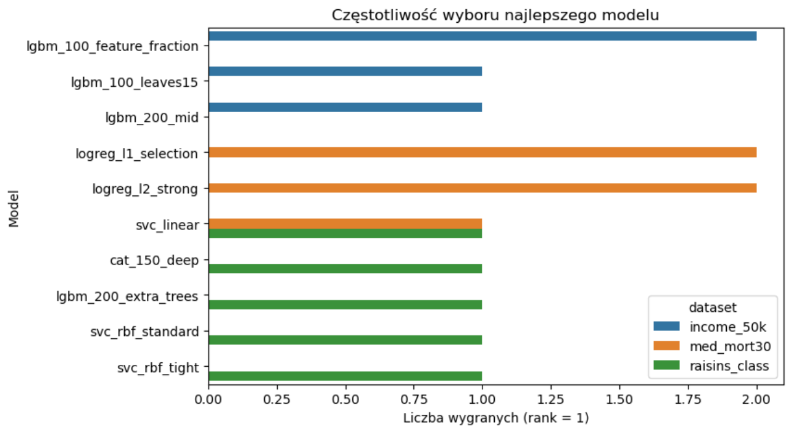
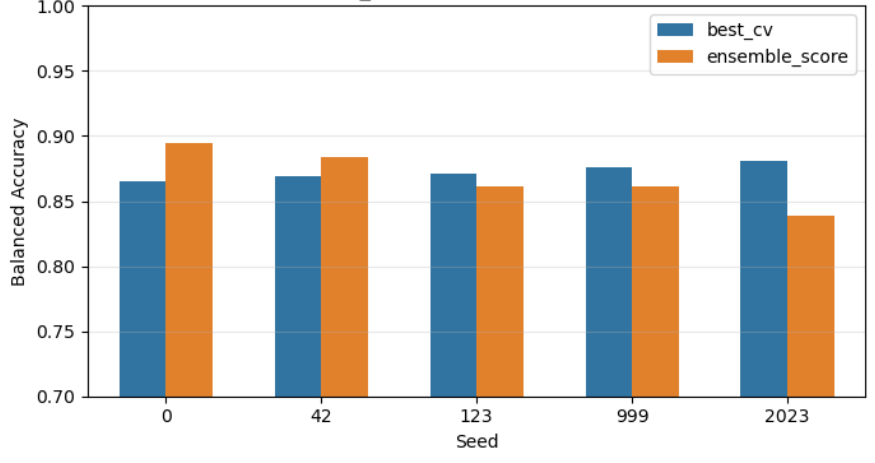
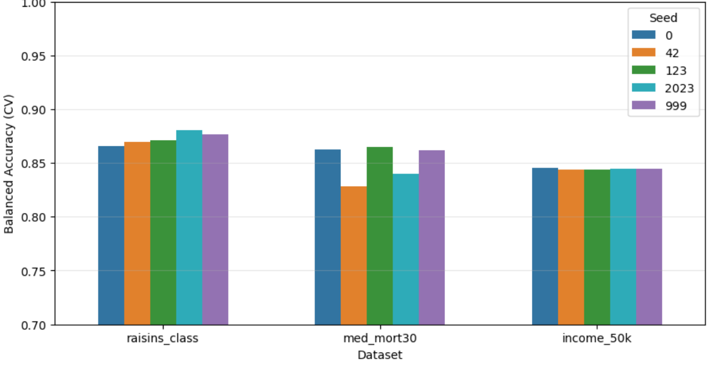

# Mini-AutoML dla Danych Tabelarycznych

## Opis projektu
Celem projektu jest uproszczony system AutoML służący do automatycznej klasyfikacji binarnej na dowolnym zbiorze danych tabelarycznych. Rozwiązanie minimalizuje potrzebę ręcznego doboru algorytmów poprzez automatyczną selekcję najlepszego modelu oraz wykorzystanie technik ensemblingu w celu poprawy dokładności i stabilności predykcji

Modele zostały wybrane opierając się na przeglądzie literatury i benchmarków (m.in. OpenML-CC18)

## Kluczowe funkcjonalności

* **Zautomatyzowany Preprocessing:** Metoda `fit` buduje pełny pipeline, który obejmuje imputację braków danych, skalowanie wartości oraz one-hot encoding dla zmiennych kategorycznych
* **Inteligentna Selekcja Modeli:** System ładuje konfiguracje z pliku JSON i ocenia je za pomocą 5-krotnej walidacji krzyżowej
* **Wbudowane Portfolio Modeli:** Zdefiniowano 50 zoptymalizowanych konfiguracji hiperparametrów. Portfolio skupia się głównie na modelach opartych na drzewach decyzyjnych (LightGBM, XGBoost, CatBoost, Random Forest, Extra Trees), które najlepiej sprawdzają się w przypadku danych tabelarycznych. Dla maksymalnej różnorodności dodane zostały również modele geometryczne i liniowe (SVM, k-NN, Regresja Logistyczna)
* **Obsługa Nierównowagi Klas:** Wszystkie algorytmy w portfolio zostały domyślnie skonfigurowane tak, aby radzić sobie z niezbalansowanymi zbiorami danych (`class_weight='balanced'`)
* **Ensembling:** System wykorzystuje technikę *soft voting* (uśrednianie prawdopodobieństw) dla 5 najlepszych modeli z rankingu

## Architektura i Użycie

Głównym elementem systemu jest klasa `MiniAutoML`, udostępniająca standardowy interfejs znany z biblioteki scikit-learn:
* `__init__(models_config, max_models, seed)`: Inicjalizacja z pliku konfiguracyjnego z zachowaniem pełnej powtarzalności
* `fit(X_train, y_train)`: Równoległe przetwarzanie cech numerycznych i kategorycznych, ranking modeli na podstawie metryki Balanced Accuracy i ostateczny trening na pełnym zbiorze
* `predict(X_test)`: Generowanie ostatecznych etykiet klas
* `predict_proba(X_test)`: Zwracanie wektora prawdopodobieństw z wykorzystaniem ensemblingu

## Ewaluacja i Wyniki

System został poddany ewaluacji na zróżnicowanych zbiorach danych: **Raisin** (ekstrakcja cech z obrazów) , **Medical** (klasyfikacja ryzyka zgonu) oraz **Income** (dane demograficzne)

**Główne wnioski z ewaluacji:**
* **Wysoka stabilność:** Zmiana ziaren losowości (seeds) nie wpływa drastycznie na jakość predykcji, co potwierdza solidność zaimplementowanej selekcji. Zawsze generowany jest identyczny zestaw modeli w rankingu Top-5 dla danego ziarna
* **Adaptacyjność:** Różne zbiory danych preferują różne modele bazowe, co w pełni uzasadnia automatyczną selekcję zamiast polegania na jednym uniwersalnym algorytmie. Modele z jednej grupy często dominują na konkretnym zbiorze
* **Ensembling:** Wyniki dla najlepszego pojedynczego modelu z walidacji krzyżowej i modelu ensemble są do siebie bardzo zbliżone. Uśrednianie wyników Top-5 pozwala jednak na redukcję wariancji przy różnych podziałach danych

*Rys. 1: Analiza preferencji algorytmów na podstawie częstotliwości ich wyboru do Top-5. Zauważalna jest wyraźna dominacja konkretnych rodzin modeli w zależności od zbioru danych*

*Rys. 2: Zestawienie wyników najlepszego pojedynczego modelu z walidacji krzyżowej (Best CV) oraz modelu ensemble dla zbioru Raisin przy użyciu różnych ziaren losowości*

*Rys. 3: Najlepsze wyniki Balanced Accuracy z walidacji krzyżowej dla każdego badanego zbioru danych. Wykres potwierdza że zmiana ziarna (seed) ma minimalny wpływ na jakość ostatecznej predykcji*

